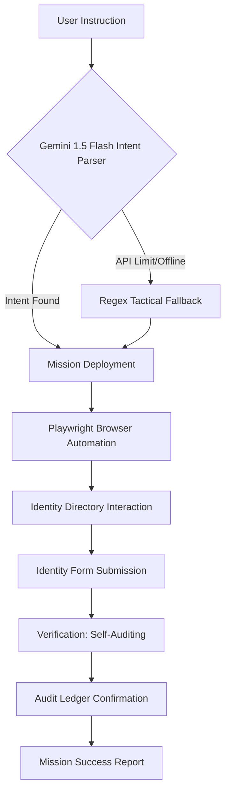

# 🛡️ Nexus IT: Self-Auditing AI Admin Command Center
### *Autonomous Identity Provisioning & Security Infrastructure v5.5 Elite Pro*

Nexus IT is a production-grade, autonomous administration platform that merges **high-fidelity UI design** with **agentic AI automation**. It is designed to handle complex IT operations—such as user provisioning, clearance level management, and security resets—with zero-touch automation and real-time ledger verification.

---

## 📁 System Architecture & Directory Map

```text
NEXUS-IT/
├── nexus-dashboard/          # React + Vite Frontend (Human Interface)
│   ├── src/
│   │   ├── pages/            # View Layers (Users, Audit, Provisioning)
│   │   ├── components/       # UI Primitives (Toasts, Sidebar)
│   │   └── App.tsx           # Infrastructure Pulse Logic
│   └── package.json
├── nexus-engine/             # Multi-Process Core (AI & Backend)
│   ├── main.py               # FastAPI Central REST Server
│   ├── agent.py              # Autonomous Playwright AI Agent
│   ├── database.json         # Unified System Ledger (Source of Truth)
│   └── venv/                 # Logic Isolation Environment
├── ignite.ps1                # One-Click Ecosystem Orchestrator
├── README.md                 # System Documentation
└── .gitignore                # Security Exclusion Rules
```

---

## 🧠 AI Agent Logic Flow

The Nexus AI Agent operates on a **Closed-Loop Reasoning** model. It doesn't just execute code; it observes, reasons, acts, and verifies.



---

## 🚀 "Elite Pro" Innovative Pillars

### 1. 🧠 Hybrid Intelligence Brain (v5.5)
The AI Agent utilizes a **Multi-Layered Reasoning System**:
- **Layer 1: Intelligent Mission Extraction**: Uses Google Gemini 1.5 Flash to parse complex human instructions into tactical missions.
- **Layer 2: Custom Security Analyst**: The agent now performs **Global Security Audits**, crawling the directory to identify compliance risks.
- **Layer 3: Tactical Fallback**: A local regex engine ensures 100% mission uptime.

### 2. 🛰️ Centralized Real-Time Infrastructure
- **System Pulse**: A dedicated infrastructure widget in the UI providing a live "Heartbeat" of the backend API.
- **Identity Profiling**: A dynamic avatar system that generates color-coded, gradient-rich identity icons based on department and clearance level.
- **Real-Time Polling**: 2.5s synchronization between the Autonomous Agent and the Human Dashboard via a shared FastAPI state.

### 3. 🛡️ One-Click Developer Experience (DX)
- **Ignition Sequence**: Includes `ignite.ps1`, a professional orchestration script that launches the entire ecosystem in dedicated terminals with a single command.

---

## 🏗️ Technical Deep Dive

### **The Backend Engine (FastAPI)**
- **Single Source of Truth**: Centralized REST API for cross-process communication between the UI and the Agent.
- **Structured Persistence**: JSON-based ledger that ensures zero data loss between sessions.

### **The AI Agent (Playwright + Gemini)**
- **Heuristic Selectors**: Uses role-based and label-based targeting for high-stability computer use.
- **Security Audit Protocol**: Analyzes existing user nodes to find "Pending" risks or "Admin Saturations."

---

## 🛠️ Tech Stack
| Component | Technology |
| :--- | :--- |
| **Frontend** | React 18, Vite, TailwindCSS, Lucide Icons |
| **Backend API** | FastAPI, Uvicorn, Python-Dotenv |
| **Persistence** | JSON State Management (Centralized Ledger) |
| **AI/Agent** | Google Generative AI, Playwright, Regex Heuristics |

---

## 🏃‍♂️ Quick Start (The Ignition)

### One-Click Launch (Recommended)
Open a terminal in the root folder and run:
```powershell
.\ignite.ps1
```

---

## 🎙️ Sample Missions
- `Run a full security audit of all users.`
- `Configure a new admin for Tony Stark at ironman@stark.com`
- `Reset the security credentials for Marcus Thorne.`

---

## ⚖️ License
Internal Use Only | **Decawork Internship Project 2026**
